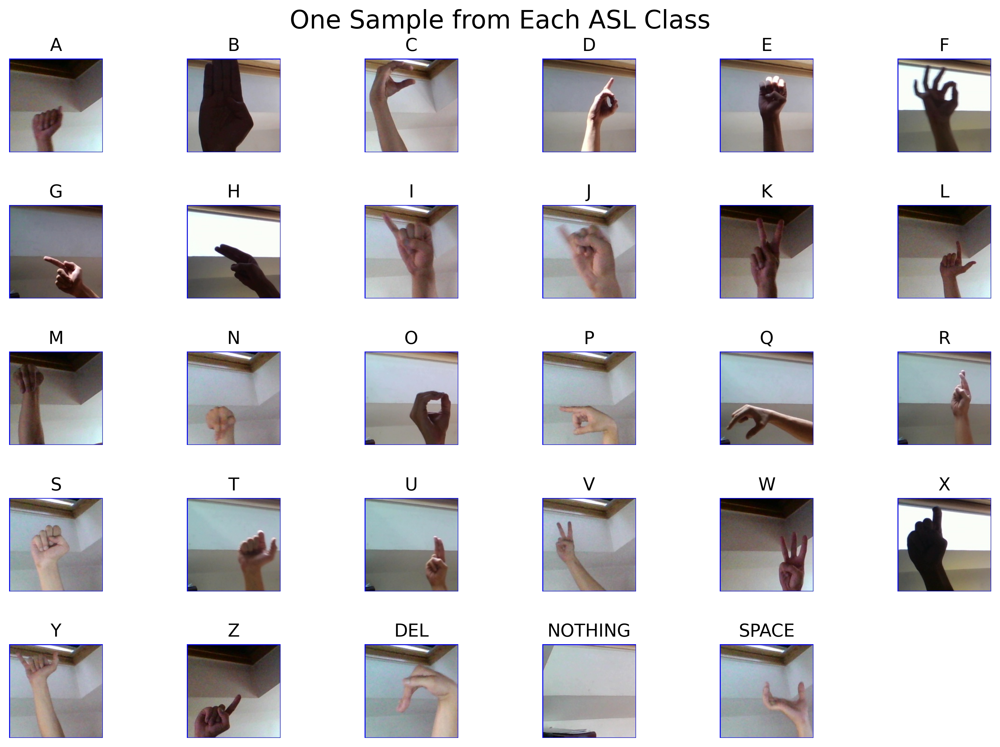
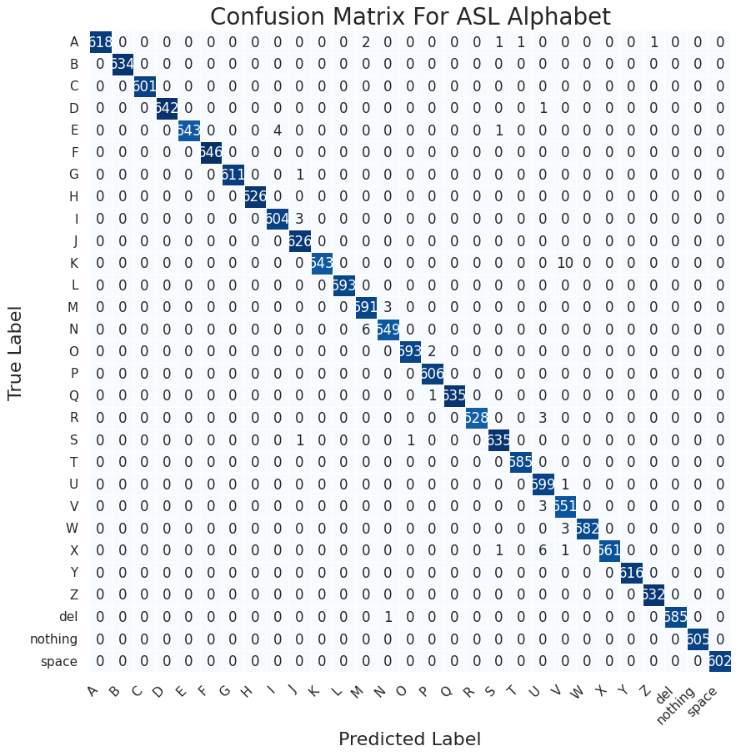

# ASL Alphabet Classifier

A deep learning project to classify American Sign Language (ASL) alphabet images using **EfficientNetB1** and **transfer learning techniques**. The model is trained and fine-tuned on an image dataset to recognize 29 hand signs (A-Z, plus "del", "space", and "nothing").

---

## Features

-  ASL hand sign classification using image input.
-  Transfer learning with **EfficientNetB1** (pretrained on ImageNet).
-  Fine-tuning to improve accuracy.
-  Data augmentation for better generalization.
-  Saves the best model using callbacks.
-  Automatically stops training when no improvement (EarlyStopping).
-  Early stopping to prevent overfitting.
-  Streamlit web interface for real-time predictions.

---

###  Sample Images from Dataset  
> *One image per ASL class (A-Z, del, nothing, space)*

--- 

## Performance

- 📊 **Training Accuracy**: ~99.5%  
- ✅ **Validation Accuracy**: ~99.7%

---

## Visual Results

### Confusion Matrix  
> *Indicates strong classification across all ASL categories*

---

## Future Improvements

- Add live webcam prediction using OpenCV.
- Expand dataset with different backgrounds and hand sizes.
- Extend model capabilities to detect and classify two-hand gestures (e.g., ASL words formed with both hands).

